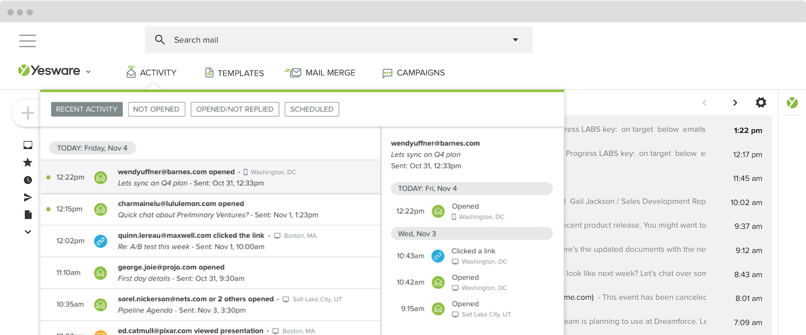

Keyword based URL TRACKER 

https://join-us-today.com/in/xxx-TRACKING_KEYWORD

Ex: https://join-us-today.com/in/amazon-tiger

tiger <> 46088
https://crm.com/id/46088

HH CRM user POST
userHost
userID
sourceURL
keyword (optional, if not specified, choose words from dictionary)

User GET 
trackingURL 

Research IP <> Location 
https://github.com/oschwald/maxminddb-golang
https://www.maxmind.com/en/geoip2-services-and-databases 
