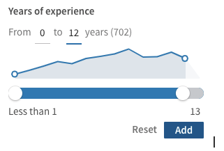
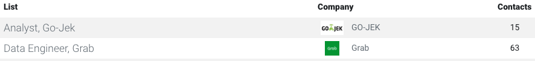

### Test Assignment 01 : React Slider with D3.js line chart

It's great to see you here! If you are interested to work with us, please consider to work on the following test assignment. This is a real project!, and it would be great to use your code in production.

### Features 
- From __ to __ input fields 
- Reset to full range 
- Optional labels "Years fo experience" and "years"
- Counter of list satisfied the criteria - (702)   
- Bind table filter with the list with counted number of items. Ex:

 

### Slider
- Use react-input-range for inspiration https://github.com/davidchin/react-input-range
- CodePen demo http://codepen.io/davidchin/full/GpNvqw/

### D3.js
- Study lightly ;) https://d3js.org/
- For line chart  use the latest version of D3.js. Currentyly 5.9.x and up https://github.com/d3/d3
- Get inspiration from https://github.com/wbkd/awesome-d3
- No charting libraries or wrapping libraries! Use only components from the official D3.js repo https://github.com/d3/d3

### Optional 
- Cover your component with Jest https://jestjs.io/ 
- Use Flow https://flow.org/
- Propose easy to use Documentation generator. Ex: https://esdoc.org/
- Create .drone.yml file for test coverage https://docs.drone.io/user-guide/pipeline/ 
- Create clean npm package https://docs.npmjs.com/ 

### Important !!!
- No typescript. We use Flow cause it's optional and easy to reuse/drop on other projects
- Use react-slingshot boiler plate for a quick start https://github.com/coryhouse/react-slingshot  
- Study SCSS, https://sass-lang.com/ 
- We don't use CSS-in-JS library in-house. Ex: Emotion, https://github.com/emotion-js/emotion 
- The end result should be a clean component with no dependencies except React.js itself and D3.js subpackages
- COMPENSATION We are not expecting this project to be a free job!
  - Please request a fair remuneration for successful completion with the strict !!! end of the project date
  - Feel free to request one or two days to think about the project
  - If you feel, you can't deliver on time, please inform us in advance. Respect your credebility, let someone else to work on this project
  - If you can't deliver on time, we are not paying for your test assignment work. Respect deadlines!
  - If you are applying for Junior Developer role, please feel free to request up to 3 months time to work on this project

### Questions
- Email questions to @reactima on [1@ilya1.com](mailto:1@ilya1.com) 

